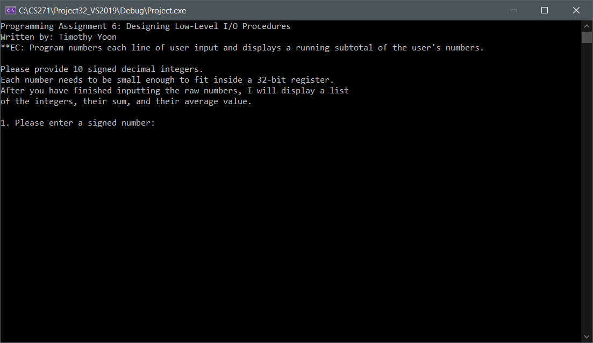
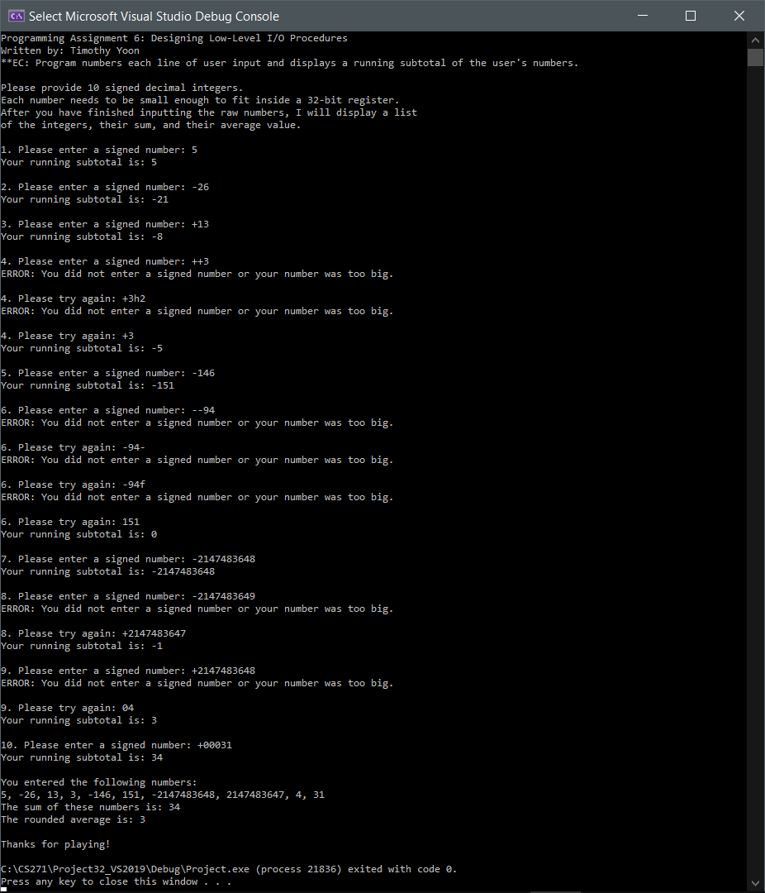

# Low-Level I/O Procedures

## Description
The .asm file implements two primary I/O procedures:
1. *ReadVal* invokes a *getString* macro to get a string of digits from the user, and converts the string to its numeric representation while validating it.

2. *WriteVal* converts a numeric value to its string representation, and invokes a *displayString* macro to display the string.

The program gets 10 signed integers from the user, stores them in an array, and then displays the values, sum and arithmetic mean of the array contents.

## Installation
1. Install [Microsoft Visual Studio](https://visualstudio.microsoft.com/vs/).

2. When asked to select your intended workload, select "Desktop development with C++."

3. Configure the necessary libraries. **Note:** If you are using an older version of Visual Studio (prior to 2019), other versions of
the textbook libraries are available from the following website: http://asmirvine.com/
   
   1. Download a zip file containing the libraries:\http://asmirvine.com/gettingStartedVS2019/Irvine.zip
   
   2. Extract the contents of this file into the C:\ directory. If the files were extracted properly, the following file should exist on your computer: C:\Irvine\Irvine32.lib
   
   3. Download a zip file containing a 32-bit Visual Studio 2019 project: http://asmirvine.com/gettingStartedVS2019/Project32_VS2019.zip
   
   4. Extract the contents of this file into a directory (e.g. C:\CS271). If the extraction was successful you should be able to locate the file: C:\CS271\Project32_VS2019\AddTwo.asm.
   
   5. Copy ioProcs.asm into C:\CS271 and run the Project.sln file that is provided in that directory.
   
   6. Log in to Visual Studio if necessary. If a security warning is displayed, indicate your preferences and click "OK".
   
   7. In the Solution Explorer pane, notice that the default .asm file in the project is AddSum2.asm. Right-click this file, click "Remove", and then click "Remove" again to remove the file from the project.
   
   8. In the Solution Explorer, right-click **Project**, hover over "Add", and click on "Existing Item...."
   
   9. In the project directory, double-click on ioProcs.asm to add that file to the project. The file name should now appear in the Solution Explorer.
   
   10. Double-click on ioProcs.asm to view its contents. It should now be ready to be assembled and run. Please see the Usage section for information on how to run the program.

## Usage
To run the program, click on "Debug", and then "Start Without Debugging" in the top toolbar. A console window with instructions should display as follows:

The line number indicates the *n*th valid number to enter, where *n* can go up to 10. As numbers are entered, the program displays the running sub-total, and once 10 valid numbers have been entered, they are printed, as well as their sum and arithmetic mean. Here is a sample program with various valid and invalid inputs:

**Note:** Since the program uses 32-bit registers, the minimum number that can be entered is -231 (-2,147,483,648), and the maximum number that can be entered is 231 - 1 (2,147,483,647).

## Built With
* assembly language
* Microsoft Macro Assembler
* Microsoft Visual Studio 2019

## Author
* Timothy Yoon

## Credits
* Project idea and specifications courtesy of Stephen Redfield and Dr. Ramesh Rajagopalan of Oregon State University's Winter 2020 CS 271 course.
